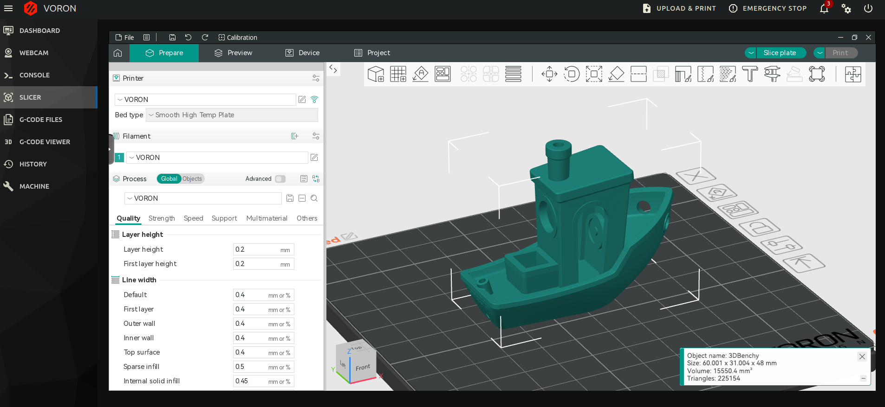
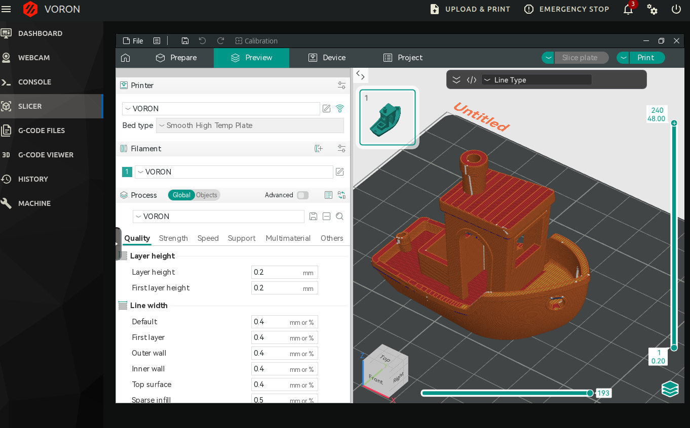

# KlipperSlicer
Slicer integration for klipper

### Access your slicer directly from web UI
- only mainsail supported for now

### Drag & drop stl/stp/3mf directly into your printer

### Don't worry about different slicer versions on different PCs

### Auto update config whenever you slice from external slicer




## Installation

If you want to have a slicer gui available in your mainsail interface, follow also steps marked as **[web]**

- run `install.sh`
- **[web]** change mainsail to my fork:
  - download and replace repo
    ```sh
    rm -rf ~/mainsail
    mkdir ~/mainsail
    cd ~/mainsail
    wget https://github.com/Matszwe02/mainsail/releases/download/v2.14.0/mainsail.zip
    unzip mainsail.zip
    ```
- **[web]** apply changes to:
  - /etc/nginx/conf.d/upstreams.conf
    ```sh
    upstream slicer {
        ip_hash;
        server 127.0.0.1:3000;
    }
    ```
  - /etc/nginx/sites-available/mainsail
    ```sh
        location /klipper-slicer/ {
        proxy_pass http://127.0.0.1:3000;
        proxy_http_version 1.1;
        proxy_set_header Upgrade $http_upgrade;
        proxy_set_header Connection $connection_upgrade;
        proxy_set_header Host $http_host;
        proxy_set_header X-Real-IP $remote_addr;
        proxy_set_header X-Forwarded-For $proxy_add_x_forwarded_for;
        proxy_read_timeout 86400;
    }
    ```
- edit your config file as per your needs
- **[web]** ensure you are running your slicer of choose in docker (preferably linuxserver) at port **3000 http**
- **[web]** reboot to enable new mainsail port forwarding